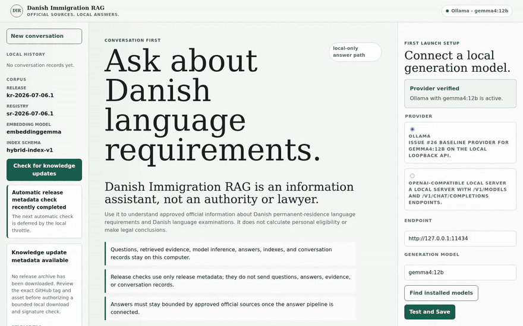
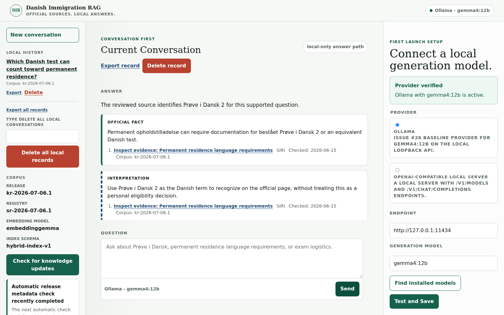
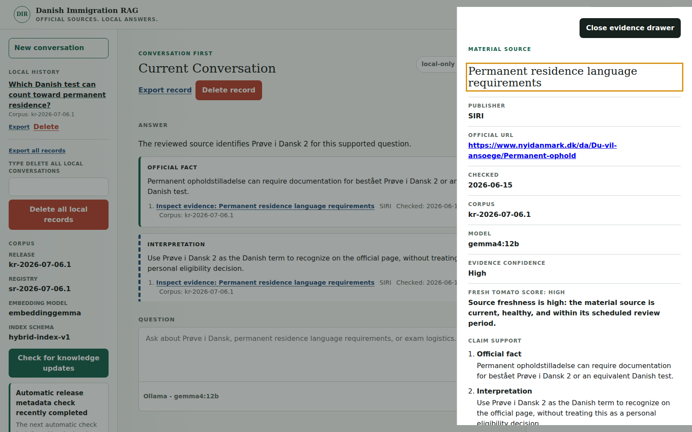
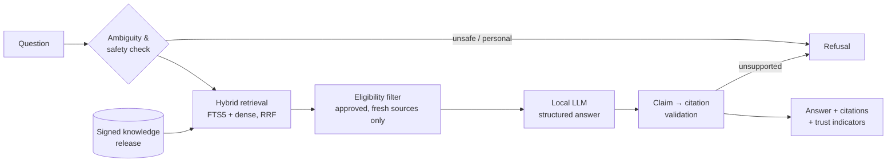

<div align="center">

# Danish Immigration RAG

**A private, local, source-grounded assistant for Danish permanent-residence language requirements and Danish language exams.**

Every official fact is cited. Unsupported claims are blocked. Nothing about your question leaves your computer.


[Demo](#demo) · [Quick start](#quick-start) · [How it works](#how-it-works) · [Trust & safety](#trust--safety) · [Evaluation](#evaluation) · [Docs](#documentation) · [Roadmap](#roadmap)

</div>

<p align="center">
  <br>
  <sub>Real run of commit <code>5d6e02b</code> with signed knowledge release <code>kr-2026-09-05.1</code> and local <code>gemma4:12b</code> (Ollama 0.34.0), fresh isolated workspace. The 18 s model wait is shortened to 3 s and labelled. <a href="docs/assets/demo.mp4">Video</a> · <a href="docs/assets/demo-recording.json">recording record</a> · re-record with <code>.venv/bin/python -m recording.record_demo --revision &lt;commit&gt;</code>.</sub>
</p>

---

## Why

Official Danish immigration sites are written for the general public, not for someone working out how the rules apply to them. Processes take months or years, so answers must stay tied to *current* official sources. Generic chatbots hallucinate; in immigration, a confident wrong answer is costly.

Danish Immigration RAG answers only from a **human-reviewed, cryptographically signed knowledge release** of official sources, shows exactly which passages support each claim, and refuses when evidence is missing.

> **Not legal advice.** It explains official requirements. It does not decide personal eligibility, keep personal profiles, or act as a legal authority.

## Demo

<p align="center">
  <br>
  <sub>Official facts and interpretation are separated; every claim carries a citation.</sub>
</p>

<p align="center">
  <br>
  <sub>The evidence drawer: official URL, check date, Evidence Confidence, Fresh Tomato Score, claim support.</sub>
</p>

> **Knowledge snapshot.** The signed knowledge release `kr-2026-09-05.1` is a **September 2026 demo snapshot and is not kept current**: no recurring source re-reviews or new releases are planned. The running app evaluates source freshness as of the release date (shown in the app), so the snapshot keeps citing its sources instead of expiring; always check the official source for current rules.

> Captured from the deterministic browser-test fixture server (`tests/browser_app_server.py`) with its bundled minimal knowledge release and a stub answer generator, so the content is illustrative, not live model output.

## Features

| | |
|---|---|
| **Evidence-bounded answers** | Structured answers where every official fact needs eligible citations; the model is never treated as a source. |
| **Hybrid retrieval** | SQLite FTS5 + local dense vectors (`embeddinggemma`), fused with reciprocal-rank fusion (`k=60`), Danish and English sources. |
| **Trust indicators** | Evidence Confidence and Fresh Tomato Score (source freshness/health) on every answer; inspect evidence in a slide-over drawer. |
| **Fully local** | Ollama on loopback, local SQLite conversations, no answer-time browsing, no remote fallback. |
| **Signed knowledge updates** | Ed25519-signed releases from GitHub Releases; explicit download and install approval, atomic install, rollback. |
| **Fail-closed evaluation** | Live and human-adjudicated release gates; absent or stale evidence blocks release. |
| **Accessible UI** | Server-rendered HTMX UI verified with Playwright + axe-core: keyboard, reduced motion, narrow screens, 200% zoom. |

## How it works



1. **Knowledge release** — five official sources (nyidanmark.dk, danskogproever.dk) are human-reviewed, chunked, signed, and installed locally.
2. **Retrieve** — hybrid lexical + dense search; ineligible sources get no credit.
3. **Generate** — a local model produces a structured answer separating *official fact* from *interpretation*.
4. **Validate** — each claim must map to an eligible citation, otherwise it is declined.
5. **Present** — compact citations, source check date, Evidence Confidence, Fresh Tomato Score.

Full design: [docs/architecture.md](docs/architecture.md).

## Quick start

**Supported environment (MVP):** Ubuntu on Windows 11 WSL2, x86-64.

**Prerequisites**

- Python 3.11+
- Node.js + npm (browser tests only)
- OpenSSL with Ed25519 support
- [Ollama](https://ollama.com) 0.30.6+ with the qualified models:

```bash
ollama pull gemma4:12b
ollama pull embeddinggemma
```

**Install and run**

```bash
python3 -m venv .venv
.venv/bin/python -m pip install -r requirements.txt
npm install                      # optional, for browser tests

.venv/bin/python -m danish_rag.local_app
```

Open <http://127.0.0.1:8000>. First launch shows a setup page that validates and stores your provider config in a per-user path. Any compatible loopback provider works; Ollama is the qualification baseline.

**Knowledge updates.** After load, the page makes one throttled, loopback-initiated check of bounded GitHub Release *metadata* — never a download. Download and install each need their own explicit click, and the Corpus panel reports success only once the approved release is active.

## Trust & safety

- **Privacy boundary** — questions, evidence, inference, answers, indexes, and history stay on your machine. Network use is limited to release discovery and approved release download.
- **Source governance** — human-reviewed registry, separation of duties, signed manifests, project trust root. See [docs/source-governance.md](docs/source-governance.md).
- **Refusals** — personal-eligibility conclusions and unsupported claims are declined explicitly.
- **Loopback only** — Host/Origin checks on all state-changing requests.
- **Safe recovery** — atomic install with a five-stage rollback matrix.

## Evaluation

Retrieval quality and final-answer quality are measured separately, against a versioned quality bar ([docs/evaluation-quality-bar.md](docs/evaluation-quality-bar.md)).

| Gate | Result (candidate `kr-2026-09-05.1`) |
|---|---|
| Live final-answer surfaces | 20 / 20, zero execution errors |
| Required facts (human-adjudicated) | 59 / 60 (threshold 95%) |
| Supported citation relationships | 47 / 47 |
| Unsupported claims | 0 |
| Production retrieval benchmark | 15 / 15 critical cases |
| Python regression suite | 502 tests, 0 failures, 5 skips |
| Manual assistive-technology journeys | 8 / 8 |

Details and limitations: [docs/release-qualification.md](docs/release-qualification.md).

### Run the tests

```bash
.venv/bin/python -B -m unittest discover -v     # unit + integration
npm run test:browser                            # Playwright + axe-core
```

<details>
<summary><b>Benchmarks and live gates</b></summary>

```bash
# Live local provider gate
.venv/bin/python -B -m danish_rag.runtime_probe \
  --policy config/runtime-policy.json \
  --evidence docs/progress/issue-26-runtime-probe.json

# Retrieval benchmarks
.venv/bin/python -B -m danish_rag.retrieval_benchmark \
  --corpus data/retrieval_benchmark/corpus-fixtures.json \
  --queries data/retrieval_benchmark/evaluation-queries.json \
  --output docs/progress/issue-27-retrieval-benchmark.json
.venv/bin/python -B -m danish_rag.retrieval_benchmark --mode dense
.venv/bin/python -B -m danish_rag.retrieval_benchmark --mode compare

# Opt-in live dense gate
DI_RAG_RUN_LIVE_DENSE_BENCHMARK=1 \
  .venv/bin/python -B -m unittest tests.test_dense_retrieval_benchmark_live -v
```

Release-evidence collection (monitors, packet replay, human adjudication): [docs/live-evaluation.md](docs/live-evaluation.md).

</details>

## Project status

As of 2026-09-08 the MVP release candidate is **qualified** for Windows 11 + WSL2 Ubuntu (x86-64). Application commit `d3eeb2a`; active signed knowledge release `kr-2026-09-05.1`. It is installed locally; **no GitHub release has been published yet.** macOS and native Linux are unpublished candidates.

**Snapshot mode (2026-10-07).** The knowledge release is a September 2026 demo snapshot and is not kept current ([details](docs/source-governance.md#snapshot-mode-2026-10-07)). A fresh install uses the newest bundled signed release (`kr-2026-09-05.1`), and the UI states the snapshot date on every page.

Gate evidence: [release-qualification.md](docs/release-qualification.md) · [release-evaluation-current.json](docs/progress/release-evaluation-current.json) · [owner approval](docs/progress/release-owner-approval-20260908.json).

## Repository layout

```text
danish_rag/            application + evaluation modules (retrieval, answer pipeline, release trust…)
danish_rag/web/        Jinja templates, HTMX UI, static assets
config/                runtime policy, quality bar, qualification, trust roots
data/                  signed knowledge releases, source registry, evaluation sets
docs/                  architecture, governance, qualification, progress evidence
tests/                 unit, integration, opt-in live, Playwright browser tests
recording/             reproducible README demo recording (isolated app, capture, encode)
CONTEXT.md             domain vocabulary and product boundary
```

## Documentation

| Start here | Purpose |
|---|---|
| [docs/README.md](docs/README.md) | Full documentation index |
| [CONTEXT.md](CONTEXT.md) | Project vocabulary, product boundary |
| [docs/architecture.md](docs/architecture.md) | Authoritative architecture |
| [docs/runtime-baseline.md](docs/runtime-baseline.md) | Provider/runtime contract |
| [docs/source-governance.md](docs/source-governance.md) | Source lifecycle, signing, roles |
| [docs/evaluation-quality-bar.md](docs/evaluation-quality-bar.md) | Metrics and release thresholds |
| [docs/release-qualification.md](docs/release-qualification.md) | Current gate state |
| [docs/agents/README.md](docs/agents/README.md) | Agent-facing system map and SOPs |

Work items and the product PRD live in [GitHub Issues](https://github.com/EricleungDK/Danish-Immigration-Assistant/issues) ([#1](https://github.com/EricleungDK/Danish-Immigration-Assistant/issues/1) is the canonical PRD).

## Roadmap

- Publish the qualified release to GitHub Releases.
- macOS and native Linux qualification.
- A guided personal-profile layer — only after the source-backed assistant is stable, with stronger privacy design, explicit consent, and stricter refusal behavior.

## Built with AI, owned by a human

AI coding agents helped draft code, tests, docs, and issue-based plans. The owner defined scope, user problem, acceptance criteria, and product boundaries, ran the tests, and reviewed whether behavior met the safety goal: **source-backed guidance, not legal authority.**
